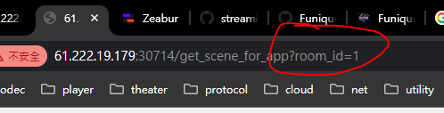
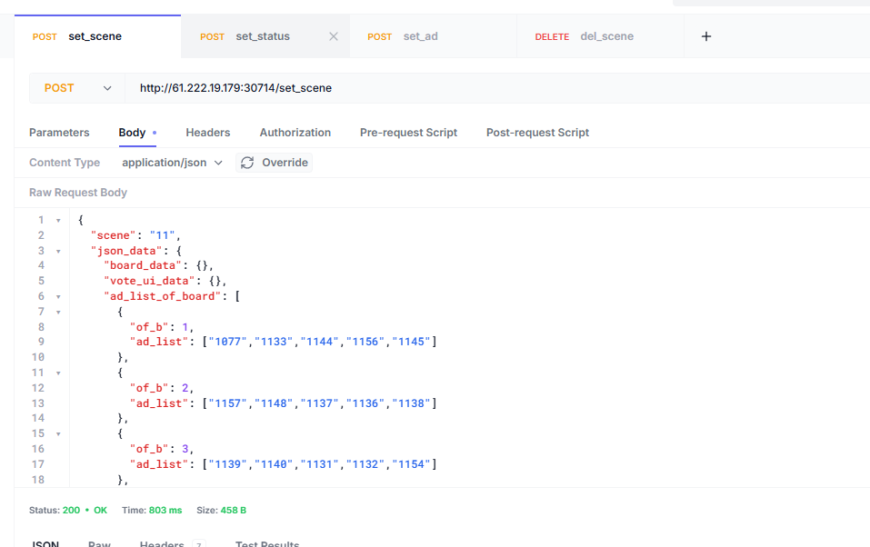

# AD_Info

## 重點資訊

* IP Address: 61.222.19.179
* Port: 30714

[get_status room 1](http://61.222.19.179:30714/get_status?room_id=1)

[get_scene_for_app room 1](http://61.222.19.179:30714/get_scene_for_app?room_id=1)


## 看伺服器

[Zeabur backend](https://zeabur.com/projects/696dc8362952d01a4bcfd867/services/69c48abf82fb34707a9ef8ef/deployments/containerized?envID=696dc836a7aaff0c1152f3e5)

這個看 Websocket Log

[Zeabur Server CLI](https://zeabur.com/omni/terminal?serverID=696dc4c15164b1787ecba811)

這個看 私有雲的 Network Mapping

CLI 進去後 

```bash
bash k9s.sh
```

## Q&A

#### 怎麼改 Room id?



#### 怎麼改 AD ID


